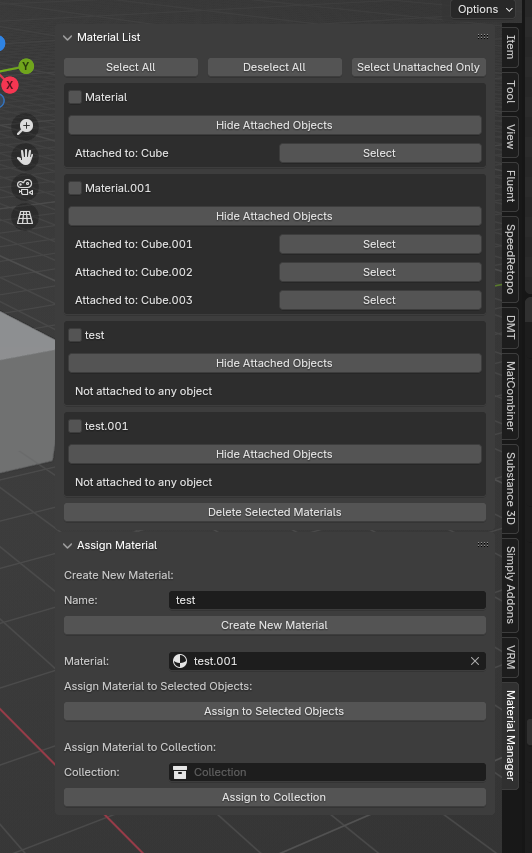
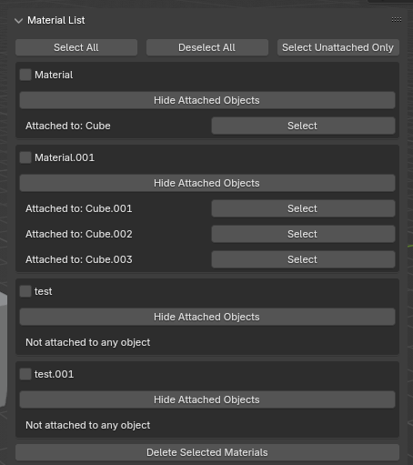
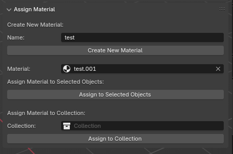

# 7sai Material Manager

**Note:** The following text is a translation by ChatGPT, and the original Japanese text is considered the authoritative version.

[日本語を表示](README_jp.md)

This is an add-on to simplify material management and assignment in Blender. With this add-on, you can easily create, assign, and manage materials for objects and collections.

## Features
- Create new materials within the Blender UI.
- Assign materials to selected objects or entire collections.
- Manage all materials and their assigned objects.
- Select objects related to each material.
- Easily delete selected materials.
- Select/Deselect all materials or only select unassigned materials.

## Installation
1. Download the add-on file.
2. In Blender, go to `Edit > Preferences > Add-ons`.
3. Click the “Install” button and select the downloaded add-on file.
4. After installation, check the box next to “7sai Material Manager” to enable the add-on.

## How to Use

Go to the sidebar in the 3D View (`View3D > Sidebar > Material Manager`).

### Managing Materials

In the “Material List” panel, you can manage existing materials:
   - Select/Deselect all materials.
   - Select only unassigned materials.
   - Display the objects assigned to each material.
   - Delete selected materials.

### Creating and Assigning Materials

In the “Assign Material” panel, you can create new materials and assign them to objects or collections:

#### Create New Material
Create a new material.
1. Enter a name for the new material in the "Name" field.
2. Click the "Create New Material" button.

#### Assign to Selected Objects
Assign a material to selected objects.
1. Enter the material to assign in the "Material" field.
2. Select the objects you want to assign the material to.
3. Click the "Assign to Selected Objects" button.

#### Assign to Collection
1. Enter the material to assign in the "Material" field in the panel.
2. Enter the collection you want to assign the material to in the "Collection" field.
3. Click the "Assign to Collection" button.

## License
This add-on is released under the Gnu GPL v3 license. For more details, please refer to the [LICENSE](LICENSE) file.
